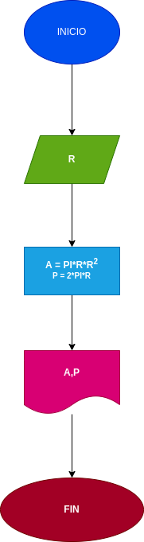

# Ejercicio No.1

## Calcular el area y el perimetrode un circulo de radio R.

# ANALISIS

Variable de entrada(imput)

R: Radio Del circulo

Variablede proceso y slida (processing, storage, output)

A: Area del circulo
P: Perimetro del circulo

# DISEÑO

# CONSTRUCCION 